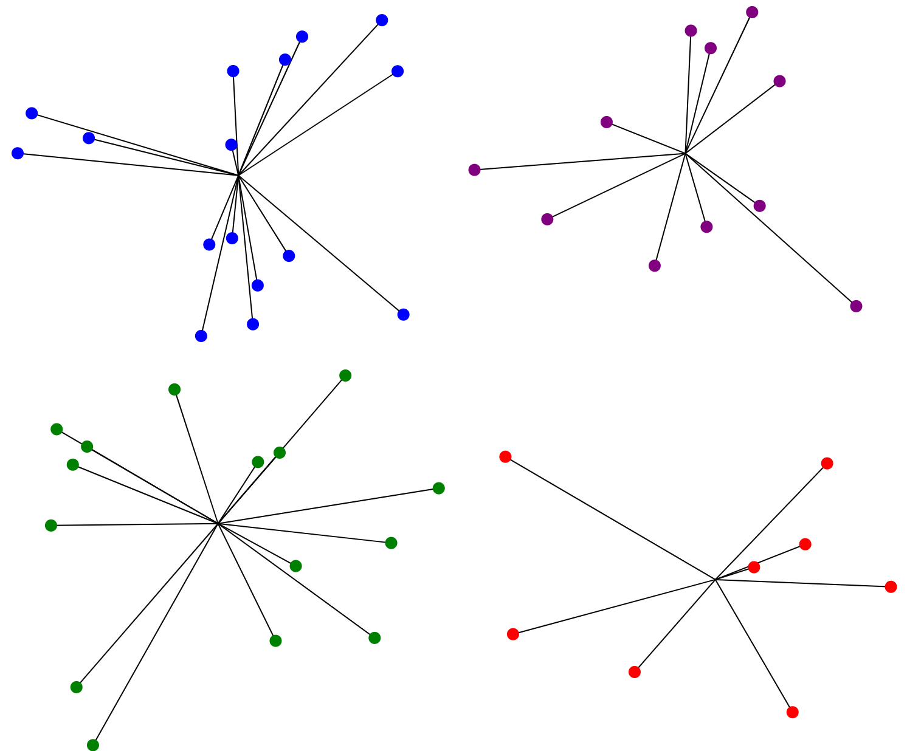

# K-Means Clustering

Visualizing K-Means Clustering

[k-means clustering - Wikipedia](https://en.wikipedia.org/wiki/K-means_clustering)

Example of implementation of the 4-means clustering algorithm for 50 vertices generated randomly.

